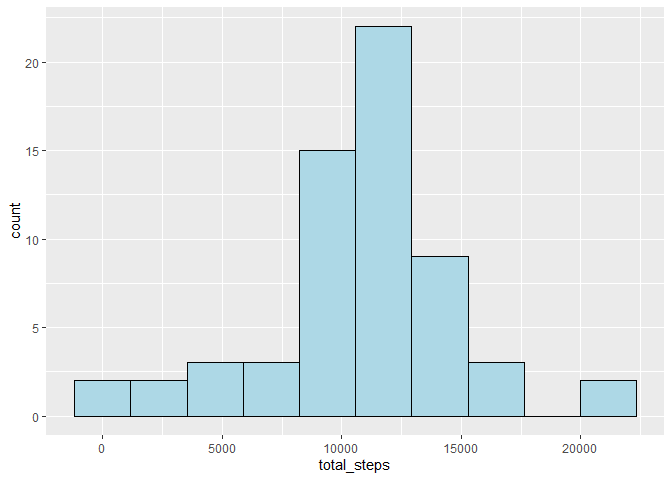

<h2><p style="text-align: center; color: blue">Exploration of data from a Personal Activity Monitoring Device</p></h2>


This is an exploration of data from a personal activity monitoring device. First we will read in the interval data:

## Loading and preprocessing the data


```r
activity <- read.csv("activity.csv")
```

## What is mean total number of steps taken per day?

We will now look at the total number of steps taken each day. We will show this with a histogram.


```r
daily_activity <- activity %>%
    group_by(date) %>%
    summarise(total_steps = sum(steps)) %>%
    mutate(date = as.Date(date))

ggplot(daily_activity, aes(x=total_steps)) +
    geom_histogram(bins = 10, fill="light blue", color = "black")
```

<!-- -->

Let's take a look at the mean and median steps taken each day:


```r
stats <- daily_activity %>%
    summarise(mean = mean(total_steps, na.rm = TRUE),
              median = median(total_steps, na.rm = TRUE))

stats %>%
    gt() %>%
    tab_header(
        title = html("Steps per Day "),
    ) %>%
    cols_label(
        "mean" = "Mean",
        "median" = "Median",
    )
```

```{=html}
<div id="lksswsazqs" style="padding-left:0px;padding-right:0px;padding-top:10px;padding-bottom:10px;overflow-x:auto;overflow-y:auto;width:auto;height:auto;">
<style>html {
  font-family: -apple-system, BlinkMacSystemFont, 'Segoe UI', Roboto, Oxygen, Ubuntu, Cantarell, 'Helvetica Neue', 'Fira Sans', 'Droid Sans', Arial, sans-serif;
}

#lksswsazqs .gt_table {
  display: table;
  border-collapse: collapse;
  margin-left: auto;
  margin-right: auto;
  color: #333333;
  font-size: 16px;
  font-weight: normal;
  font-style: normal;
  background-color: #FFFFFF;
  width: auto;
  border-top-style: solid;
  border-top-width: 2px;
  border-top-color: #A8A8A8;
  border-right-style: none;
  border-right-width: 2px;
  border-right-color: #D3D3D3;
  border-bottom-style: solid;
  border-bottom-width: 2px;
  border-bottom-color: #A8A8A8;
  border-left-style: none;
  border-left-width: 2px;
  border-left-color: #D3D3D3;
}

#lksswsazqs .gt_heading {
  background-color: #FFFFFF;
  text-align: center;
  border-bottom-color: #FFFFFF;
  border-left-style: none;
  border-left-width: 1px;
  border-left-color: #D3D3D3;
  border-right-style: none;
  border-right-width: 1px;
  border-right-color: #D3D3D3;
}

#lksswsazqs .gt_caption {
  padding-top: 4px;
  padding-bottom: 4px;
}

#lksswsazqs .gt_title {
  color: #333333;
  font-size: 125%;
  font-weight: initial;
  padding-top: 4px;
  padding-bottom: 4px;
  padding-left: 5px;
  padding-right: 5px;
  border-bottom-color: #FFFFFF;
  border-bottom-width: 0;
}

#lksswsazqs .gt_subtitle {
  color: #333333;
  font-size: 85%;
  font-weight: initial;
  padding-top: 0;
  padding-bottom: 6px;
  padding-left: 5px;
  padding-right: 5px;
  border-top-color: #FFFFFF;
  border-top-width: 0;
}

#lksswsazqs .gt_bottom_border {
  border-bottom-style: solid;
  border-bottom-width: 2px;
  border-bottom-color: #D3D3D3;
}

#lksswsazqs .gt_col_headings {
  border-top-style: solid;
  border-top-width: 2px;
  border-top-color: #D3D3D3;
  border-bottom-style: solid;
  border-bottom-width: 2px;
  border-bottom-color: #D3D3D3;
  border-left-style: none;
  border-left-width: 1px;
  border-left-color: #D3D3D3;
  border-right-style: none;
  border-right-width: 1px;
  border-right-color: #D3D3D3;
}

#lksswsazqs .gt_col_heading {
  color: #333333;
  background-color: #FFFFFF;
  font-size: 100%;
  font-weight: normal;
  text-transform: inherit;
  border-left-style: none;
  border-left-width: 1px;
  border-left-color: #D3D3D3;
  border-right-style: none;
  border-right-width: 1px;
  border-right-color: #D3D3D3;
  vertical-align: bottom;
  padding-top: 5px;
  padding-bottom: 6px;
  padding-left: 5px;
  padding-right: 5px;
  overflow-x: hidden;
}

#lksswsazqs .gt_column_spanner_outer {
  color: #333333;
  background-color: #FFFFFF;
  font-size: 100%;
  font-weight: normal;
  text-transform: inherit;
  padding-top: 0;
  padding-bottom: 0;
  padding-left: 4px;
  padding-right: 4px;
}

#lksswsazqs .gt_column_spanner_outer:first-child {
  padding-left: 0;
}

#lksswsazqs .gt_column_spanner_outer:last-child {
  padding-right: 0;
}

#lksswsazqs .gt_column_spanner {
  border-bottom-style: solid;
  border-bottom-width: 2px;
  border-bottom-color: #D3D3D3;
  vertical-align: bottom;
  padding-top: 5px;
  padding-bottom: 5px;
  overflow-x: hidden;
  display: inline-block;
  width: 100%;
}

#lksswsazqs .gt_group_heading {
  padding-top: 8px;
  padding-bottom: 8px;
  padding-left: 5px;
  padding-right: 5px;
  color: #333333;
  background-color: #FFFFFF;
  font-size: 100%;
  font-weight: initial;
  text-transform: inherit;
  border-top-style: solid;
  border-top-width: 2px;
  border-top-color: #D3D3D3;
  border-bottom-style: solid;
  border-bottom-width: 2px;
  border-bottom-color: #D3D3D3;
  border-left-style: none;
  border-left-width: 1px;
  border-left-color: #D3D3D3;
  border-right-style: none;
  border-right-width: 1px;
  border-right-color: #D3D3D3;
  vertical-align: middle;
  text-align: left;
}

#lksswsazqs .gt_empty_group_heading {
  padding: 0.5px;
  color: #333333;
  background-color: #FFFFFF;
  font-size: 100%;
  font-weight: initial;
  border-top-style: solid;
  border-top-width: 2px;
  border-top-color: #D3D3D3;
  border-bottom-style: solid;
  border-bottom-width: 2px;
  border-bottom-color: #D3D3D3;
  vertical-align: middle;
}

#lksswsazqs .gt_from_md > :first-child {
  margin-top: 0;
}

#lksswsazqs .gt_from_md > :last-child {
  margin-bottom: 0;
}

#lksswsazqs .gt_row {
  padding-top: 8px;
  padding-bottom: 8px;
  padding-left: 5px;
  padding-right: 5px;
  margin: 10px;
  border-top-style: solid;
  border-top-width: 1px;
  border-top-color: #D3D3D3;
  border-left-style: none;
  border-left-width: 1px;
  border-left-color: #D3D3D3;
  border-right-style: none;
  border-right-width: 1px;
  border-right-color: #D3D3D3;
  vertical-align: middle;
  overflow-x: hidden;
}

#lksswsazqs .gt_stub {
  color: #333333;
  background-color: #FFFFFF;
  font-size: 100%;
  font-weight: initial;
  text-transform: inherit;
  border-right-style: solid;
  border-right-width: 2px;
  border-right-color: #D3D3D3;
  padding-left: 5px;
  padding-right: 5px;
}

#lksswsazqs .gt_stub_row_group {
  color: #333333;
  background-color: #FFFFFF;
  font-size: 100%;
  font-weight: initial;
  text-transform: inherit;
  border-right-style: solid;
  border-right-width: 2px;
  border-right-color: #D3D3D3;
  padding-left: 5px;
  padding-right: 5px;
  vertical-align: top;
}

#lksswsazqs .gt_row_group_first td {
  border-top-width: 2px;
}

#lksswsazqs .gt_summary_row {
  color: #333333;
  background-color: #FFFFFF;
  text-transform: inherit;
  padding-top: 8px;
  padding-bottom: 8px;
  padding-left: 5px;
  padding-right: 5px;
}

#lksswsazqs .gt_first_summary_row {
  border-top-style: solid;
  border-top-color: #D3D3D3;
}

#lksswsazqs .gt_first_summary_row.thick {
  border-top-width: 2px;
}

#lksswsazqs .gt_last_summary_row {
  padding-top: 8px;
  padding-bottom: 8px;
  padding-left: 5px;
  padding-right: 5px;
  border-bottom-style: solid;
  border-bottom-width: 2px;
  border-bottom-color: #D3D3D3;
}

#lksswsazqs .gt_grand_summary_row {
  color: #333333;
  background-color: #FFFFFF;
  text-transform: inherit;
  padding-top: 8px;
  padding-bottom: 8px;
  padding-left: 5px;
  padding-right: 5px;
}

#lksswsazqs .gt_first_grand_summary_row {
  padding-top: 8px;
  padding-bottom: 8px;
  padding-left: 5px;
  padding-right: 5px;
  border-top-style: double;
  border-top-width: 6px;
  border-top-color: #D3D3D3;
}

#lksswsazqs .gt_striped {
  background-color: rgba(128, 128, 128, 0.05);
}

#lksswsazqs .gt_table_body {
  border-top-style: solid;
  border-top-width: 2px;
  border-top-color: #D3D3D3;
  border-bottom-style: solid;
  border-bottom-width: 2px;
  border-bottom-color: #D3D3D3;
}

#lksswsazqs .gt_footnotes {
  color: #333333;
  background-color: #FFFFFF;
  border-bottom-style: none;
  border-bottom-width: 2px;
  border-bottom-color: #D3D3D3;
  border-left-style: none;
  border-left-width: 2px;
  border-left-color: #D3D3D3;
  border-right-style: none;
  border-right-width: 2px;
  border-right-color: #D3D3D3;
}

#lksswsazqs .gt_footnote {
  margin: 0px;
  font-size: 90%;
  padding-left: 4px;
  padding-right: 4px;
  padding-left: 5px;
  padding-right: 5px;
}

#lksswsazqs .gt_sourcenotes {
  color: #333333;
  background-color: #FFFFFF;
  border-bottom-style: none;
  border-bottom-width: 2px;
  border-bottom-color: #D3D3D3;
  border-left-style: none;
  border-left-width: 2px;
  border-left-color: #D3D3D3;
  border-right-style: none;
  border-right-width: 2px;
  border-right-color: #D3D3D3;
}

#lksswsazqs .gt_sourcenote {
  font-size: 90%;
  padding-top: 4px;
  padding-bottom: 4px;
  padding-left: 5px;
  padding-right: 5px;
}

#lksswsazqs .gt_left {
  text-align: left;
}

#lksswsazqs .gt_center {
  text-align: center;
}

#lksswsazqs .gt_right {
  text-align: right;
  font-variant-numeric: tabular-nums;
}

#lksswsazqs .gt_font_normal {
  font-weight: normal;
}

#lksswsazqs .gt_font_bold {
  font-weight: bold;
}

#lksswsazqs .gt_font_italic {
  font-style: italic;
}

#lksswsazqs .gt_super {
  font-size: 65%;
}

#lksswsazqs .gt_footnote_marks {
  font-style: italic;
  font-weight: normal;
  font-size: 75%;
  vertical-align: 0.4em;
}

#lksswsazqs .gt_asterisk {
  font-size: 100%;
  vertical-align: 0;
}

#lksswsazqs .gt_indent_1 {
  text-indent: 5px;
}

#lksswsazqs .gt_indent_2 {
  text-indent: 10px;
}

#lksswsazqs .gt_indent_3 {
  text-indent: 15px;
}

#lksswsazqs .gt_indent_4 {
  text-indent: 20px;
}

#lksswsazqs .gt_indent_5 {
  text-indent: 25px;
}
</style>
<table class="gt_table">
  <thead class="gt_header">
    <tr>
      <td colspan="2" class="gt_heading gt_title gt_font_normal gt_bottom_border" style>Steps per Day </td>
    </tr>
    
  </thead>
  <thead class="gt_col_headings">
    <tr>
      <th class="gt_col_heading gt_columns_bottom_border gt_right" rowspan="1" colspan="1" scope="col" id="Mean">Mean</th>
      <th class="gt_col_heading gt_columns_bottom_border gt_right" rowspan="1" colspan="1" scope="col" id="Median">Median</th>
    </tr>
  </thead>
  <tbody class="gt_table_body">
    <tr><td headers="mean" class="gt_row gt_right">10766.19</td>
<td headers="median" class="gt_row gt_right">10765</td></tr>
  </tbody>
  
  
</table>
</div>
```

## What is the average daily activity pattern?

We plot the average steps taken per time interval over the 61 days of data. We then calculate which interval has the maximum average value. We have plotted this value on our time series plot and we can see that the maximum average value per 5-minute interval is 206.17 at time the time interval identified as 835.


```r
daily_pattern <- activity %>%
    group_by(interval) %>%
    summarise(avg_steps = mean(steps,na.rm=TRUE))

max_daily <- daily_pattern %>%
    filter(avg_steps == max(avg_steps))

ggplot(daily_pattern, aes(x=interval, y=avg_steps)) +
    geom_line() +
    geom_segment(aes(x = max_daily$interval, y = 0, xend = max_daily$interval, 
                     yend = max_daily$avg_steps),linetype="dashed", color = "red") +
    geom_text(aes(label=round(avg_steps,2)),data=max_daily, hjust=1.2, vjust=3) +
    scale_x_continuous(breaks=c(0,500, max_daily$interval, 1000, 1500, 2000))
```

<!-- -->

## Imputing missing values
There are 2304 missing step count values in the data set. We will impute these values by taking the average of all the values at that same interval. There are some cases where there are no step counts on any day for a certain interval, we will impute those values with 0.


```r
num_missing <-length(activity[is.na(activity$steps),]$steps)
daily_pattern_impute <- activity %>%
    group_by(interval) %>%
    mutate(steps = ifelse(is.na(steps),0,steps)) %>%
    summarise(avg_steps = mean(steps))

activity_impute <- activity
for (i in 1:length(activity_impute$steps)){
    if (is.na(activity_impute$steps[i])){
        activity_impute$steps[i] = daily_pattern[daily_pattern$interval == activity_impute$interval[i],]$avg_steps
    }
}
```

We will now plot a histogram of the imputed data:


```r
daily_activity_new <- activity_impute %>%
    group_by(date) %>%
    summarise(total_steps = sum(steps)) %>%
    mutate(date = as.Date(date))

ggplot(daily_activity_new, aes(x=total_steps)) +
    geom_histogram(bins = 10, fill="light blue", color = "black")
```

<!-- -->

We now look at the new mean and median calculated with the imputed data. We see that the mean hasn't changed, but the median has increased.


```r
stats <- daily_activity_new %>%
    summarise(mean = mean(total_steps),
              median = median(total_steps))
stats %>%
    gt() %>%
    tab_header(
        title = html("Steps per Day (Imputed Data) "),
    ) %>%
    cols_label(
        "mean" = "Mean",
        "median" = "Median",
    )
```

```{=html}
<div id="mvxaskjqky" style="padding-left:0px;padding-right:0px;padding-top:10px;padding-bottom:10px;overflow-x:auto;overflow-y:auto;width:auto;height:auto;">
<style>html {
  font-family: -apple-system, BlinkMacSystemFont, 'Segoe UI', Roboto, Oxygen, Ubuntu, Cantarell, 'Helvetica Neue', 'Fira Sans', 'Droid Sans', Arial, sans-serif;
}

#mvxaskjqky .gt_table {
  display: table;
  border-collapse: collapse;
  margin-left: auto;
  margin-right: auto;
  color: #333333;
  font-size: 16px;
  font-weight: normal;
  font-style: normal;
  background-color: #FFFFFF;
  width: auto;
  border-top-style: solid;
  border-top-width: 2px;
  border-top-color: #A8A8A8;
  border-right-style: none;
  border-right-width: 2px;
  border-right-color: #D3D3D3;
  border-bottom-style: solid;
  border-bottom-width: 2px;
  border-bottom-color: #A8A8A8;
  border-left-style: none;
  border-left-width: 2px;
  border-left-color: #D3D3D3;
}

#mvxaskjqky .gt_heading {
  background-color: #FFFFFF;
  text-align: center;
  border-bottom-color: #FFFFFF;
  border-left-style: none;
  border-left-width: 1px;
  border-left-color: #D3D3D3;
  border-right-style: none;
  border-right-width: 1px;
  border-right-color: #D3D3D3;
}

#mvxaskjqky .gt_caption {
  padding-top: 4px;
  padding-bottom: 4px;
}

#mvxaskjqky .gt_title {
  color: #333333;
  font-size: 125%;
  font-weight: initial;
  padding-top: 4px;
  padding-bottom: 4px;
  padding-left: 5px;
  padding-right: 5px;
  border-bottom-color: #FFFFFF;
  border-bottom-width: 0;
}

#mvxaskjqky .gt_subtitle {
  color: #333333;
  font-size: 85%;
  font-weight: initial;
  padding-top: 0;
  padding-bottom: 6px;
  padding-left: 5px;
  padding-right: 5px;
  border-top-color: #FFFFFF;
  border-top-width: 0;
}

#mvxaskjqky .gt_bottom_border {
  border-bottom-style: solid;
  border-bottom-width: 2px;
  border-bottom-color: #D3D3D3;
}

#mvxaskjqky .gt_col_headings {
  border-top-style: solid;
  border-top-width: 2px;
  border-top-color: #D3D3D3;
  border-bottom-style: solid;
  border-bottom-width: 2px;
  border-bottom-color: #D3D3D3;
  border-left-style: none;
  border-left-width: 1px;
  border-left-color: #D3D3D3;
  border-right-style: none;
  border-right-width: 1px;
  border-right-color: #D3D3D3;
}

#mvxaskjqky .gt_col_heading {
  color: #333333;
  background-color: #FFFFFF;
  font-size: 100%;
  font-weight: normal;
  text-transform: inherit;
  border-left-style: none;
  border-left-width: 1px;
  border-left-color: #D3D3D3;
  border-right-style: none;
  border-right-width: 1px;
  border-right-color: #D3D3D3;
  vertical-align: bottom;
  padding-top: 5px;
  padding-bottom: 6px;
  padding-left: 5px;
  padding-right: 5px;
  overflow-x: hidden;
}

#mvxaskjqky .gt_column_spanner_outer {
  color: #333333;
  background-color: #FFFFFF;
  font-size: 100%;
  font-weight: normal;
  text-transform: inherit;
  padding-top: 0;
  padding-bottom: 0;
  padding-left: 4px;
  padding-right: 4px;
}

#mvxaskjqky .gt_column_spanner_outer:first-child {
  padding-left: 0;
}

#mvxaskjqky .gt_column_spanner_outer:last-child {
  padding-right: 0;
}

#mvxaskjqky .gt_column_spanner {
  border-bottom-style: solid;
  border-bottom-width: 2px;
  border-bottom-color: #D3D3D3;
  vertical-align: bottom;
  padding-top: 5px;
  padding-bottom: 5px;
  overflow-x: hidden;
  display: inline-block;
  width: 100%;
}

#mvxaskjqky .gt_group_heading {
  padding-top: 8px;
  padding-bottom: 8px;
  padding-left: 5px;
  padding-right: 5px;
  color: #333333;
  background-color: #FFFFFF;
  font-size: 100%;
  font-weight: initial;
  text-transform: inherit;
  border-top-style: solid;
  border-top-width: 2px;
  border-top-color: #D3D3D3;
  border-bottom-style: solid;
  border-bottom-width: 2px;
  border-bottom-color: #D3D3D3;
  border-left-style: none;
  border-left-width: 1px;
  border-left-color: #D3D3D3;
  border-right-style: none;
  border-right-width: 1px;
  border-right-color: #D3D3D3;
  vertical-align: middle;
  text-align: left;
}

#mvxaskjqky .gt_empty_group_heading {
  padding: 0.5px;
  color: #333333;
  background-color: #FFFFFF;
  font-size: 100%;
  font-weight: initial;
  border-top-style: solid;
  border-top-width: 2px;
  border-top-color: #D3D3D3;
  border-bottom-style: solid;
  border-bottom-width: 2px;
  border-bottom-color: #D3D3D3;
  vertical-align: middle;
}

#mvxaskjqky .gt_from_md > :first-child {
  margin-top: 0;
}

#mvxaskjqky .gt_from_md > :last-child {
  margin-bottom: 0;
}

#mvxaskjqky .gt_row {
  padding-top: 8px;
  padding-bottom: 8px;
  padding-left: 5px;
  padding-right: 5px;
  margin: 10px;
  border-top-style: solid;
  border-top-width: 1px;
  border-top-color: #D3D3D3;
  border-left-style: none;
  border-left-width: 1px;
  border-left-color: #D3D3D3;
  border-right-style: none;
  border-right-width: 1px;
  border-right-color: #D3D3D3;
  vertical-align: middle;
  overflow-x: hidden;
}

#mvxaskjqky .gt_stub {
  color: #333333;
  background-color: #FFFFFF;
  font-size: 100%;
  font-weight: initial;
  text-transform: inherit;
  border-right-style: solid;
  border-right-width: 2px;
  border-right-color: #D3D3D3;
  padding-left: 5px;
  padding-right: 5px;
}

#mvxaskjqky .gt_stub_row_group {
  color: #333333;
  background-color: #FFFFFF;
  font-size: 100%;
  font-weight: initial;
  text-transform: inherit;
  border-right-style: solid;
  border-right-width: 2px;
  border-right-color: #D3D3D3;
  padding-left: 5px;
  padding-right: 5px;
  vertical-align: top;
}

#mvxaskjqky .gt_row_group_first td {
  border-top-width: 2px;
}

#mvxaskjqky .gt_summary_row {
  color: #333333;
  background-color: #FFFFFF;
  text-transform: inherit;
  padding-top: 8px;
  padding-bottom: 8px;
  padding-left: 5px;
  padding-right: 5px;
}

#mvxaskjqky .gt_first_summary_row {
  border-top-style: solid;
  border-top-color: #D3D3D3;
}

#mvxaskjqky .gt_first_summary_row.thick {
  border-top-width: 2px;
}

#mvxaskjqky .gt_last_summary_row {
  padding-top: 8px;
  padding-bottom: 8px;
  padding-left: 5px;
  padding-right: 5px;
  border-bottom-style: solid;
  border-bottom-width: 2px;
  border-bottom-color: #D3D3D3;
}

#mvxaskjqky .gt_grand_summary_row {
  color: #333333;
  background-color: #FFFFFF;
  text-transform: inherit;
  padding-top: 8px;
  padding-bottom: 8px;
  padding-left: 5px;
  padding-right: 5px;
}

#mvxaskjqky .gt_first_grand_summary_row {
  padding-top: 8px;
  padding-bottom: 8px;
  padding-left: 5px;
  padding-right: 5px;
  border-top-style: double;
  border-top-width: 6px;
  border-top-color: #D3D3D3;
}

#mvxaskjqky .gt_striped {
  background-color: rgba(128, 128, 128, 0.05);
}

#mvxaskjqky .gt_table_body {
  border-top-style: solid;
  border-top-width: 2px;
  border-top-color: #D3D3D3;
  border-bottom-style: solid;
  border-bottom-width: 2px;
  border-bottom-color: #D3D3D3;
}

#mvxaskjqky .gt_footnotes {
  color: #333333;
  background-color: #FFFFFF;
  border-bottom-style: none;
  border-bottom-width: 2px;
  border-bottom-color: #D3D3D3;
  border-left-style: none;
  border-left-width: 2px;
  border-left-color: #D3D3D3;
  border-right-style: none;
  border-right-width: 2px;
  border-right-color: #D3D3D3;
}

#mvxaskjqky .gt_footnote {
  margin: 0px;
  font-size: 90%;
  padding-left: 4px;
  padding-right: 4px;
  padding-left: 5px;
  padding-right: 5px;
}

#mvxaskjqky .gt_sourcenotes {
  color: #333333;
  background-color: #FFFFFF;
  border-bottom-style: none;
  border-bottom-width: 2px;
  border-bottom-color: #D3D3D3;
  border-left-style: none;
  border-left-width: 2px;
  border-left-color: #D3D3D3;
  border-right-style: none;
  border-right-width: 2px;
  border-right-color: #D3D3D3;
}

#mvxaskjqky .gt_sourcenote {
  font-size: 90%;
  padding-top: 4px;
  padding-bottom: 4px;
  padding-left: 5px;
  padding-right: 5px;
}

#mvxaskjqky .gt_left {
  text-align: left;
}

#mvxaskjqky .gt_center {
  text-align: center;
}

#mvxaskjqky .gt_right {
  text-align: right;
  font-variant-numeric: tabular-nums;
}

#mvxaskjqky .gt_font_normal {
  font-weight: normal;
}

#mvxaskjqky .gt_font_bold {
  font-weight: bold;
}

#mvxaskjqky .gt_font_italic {
  font-style: italic;
}

#mvxaskjqky .gt_super {
  font-size: 65%;
}

#mvxaskjqky .gt_footnote_marks {
  font-style: italic;
  font-weight: normal;
  font-size: 75%;
  vertical-align: 0.4em;
}

#mvxaskjqky .gt_asterisk {
  font-size: 100%;
  vertical-align: 0;
}

#mvxaskjqky .gt_indent_1 {
  text-indent: 5px;
}

#mvxaskjqky .gt_indent_2 {
  text-indent: 10px;
}

#mvxaskjqky .gt_indent_3 {
  text-indent: 15px;
}

#mvxaskjqky .gt_indent_4 {
  text-indent: 20px;
}

#mvxaskjqky .gt_indent_5 {
  text-indent: 25px;
}
</style>
<table class="gt_table">
  <thead class="gt_header">
    <tr>
      <td colspan="2" class="gt_heading gt_title gt_font_normal gt_bottom_border" style>Steps per Day (Imputed Data) </td>
    </tr>
    
  </thead>
  <thead class="gt_col_headings">
    <tr>
      <th class="gt_col_heading gt_columns_bottom_border gt_right" rowspan="1" colspan="1" scope="col" id="Mean">Mean</th>
      <th class="gt_col_heading gt_columns_bottom_border gt_right" rowspan="1" colspan="1" scope="col" id="Median">Median</th>
    </tr>
  </thead>
  <tbody class="gt_table_body">
    <tr><td headers="mean" class="gt_row gt_right">10766.19</td>
<td headers="median" class="gt_row gt_right">10766.19</td></tr>
  </tbody>
  
  
</table>
</div>
```

## Are there differences in activity patterns between weekdays and weekends?

We now will separate weekends and weekdays and plot the average steps taken by time interval for each. We can see that on weekends the average steps per interval is higher throughout the day, while on weekdays, the earlier intervals have a much higher average than the intervals throught the remainder of the day.


```r
activity_impute <- activity_impute %>%
    mutate(day_type = ifelse(isWeekday(date) == TRUE, "Weekday", "Weekend"))

daily_pattern <- activity_impute %>%
    group_by(interval,day_type) %>%
    summarise(avg_steps = mean(steps,na.rm=TRUE))

ggplot(daily_pattern, aes(x=interval, y=avg_steps)) +
    geom_line() +
    facet_wrap(~ day_type, ncol=1)
```

<!-- -->
